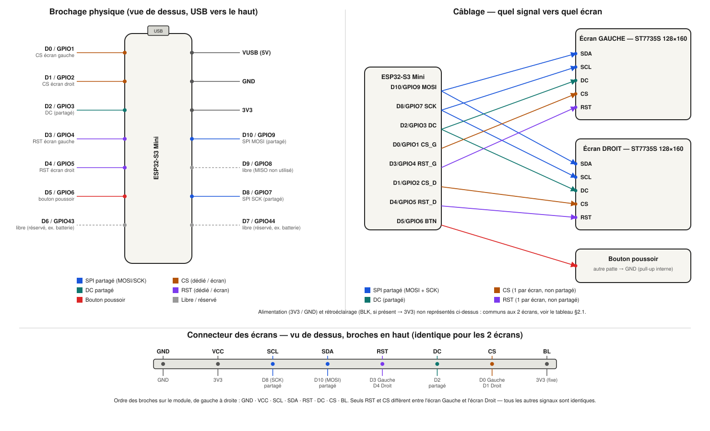

# Firmware ESP32 — Lunettes Eyzo

Firmware pour le **Seeed Studio XIAO ESP32S3**, pilotant les 2 écrans SPI
ST7735S 1,77" et le bouton poussoir des lunettes, et implémentant le
protocole BLE défini dans `specs.md` (§6) à la racine du projet.

Le code source est dans le dossier [`EyzoFirmware/`](./EyzoFirmware) — c'est
ce dossier qu'il faut ouvrir dans Arduino IDE (double-clic sur
`EyzoFirmware.ino`).

> Ce firmware a été **compilé avec succès** (`arduino-cli compile`, core
> `esp32:esp32` v3.3.11, carte `XIAO_ESP32S3`, PSRAM=OPI) — 17 % flash / 12 %
> RAM utilisés (dernière vérification). Le socle (écrans, bouton, connexion
> BLE, envoi de texte et d'images compressés en zlib) **a été validé sur le
> matériel réel** — **important : nécessite l'option `PSRAM=OPI` activée
> dans Arduino IDE** (`Outils > PSRAM > OPI PSRAM`), sans quoi le buffer de
> réassemblage BLE ne s'alloue pas et toute commande échoue silencieusement
> (voir §5 sur l'ACK/NACK applicatif, désormais consommé côté app). Le
> nouveau `SET_ANIMATION` (toutes les frames compressées ensemble en une
> seule commande, voir §4) est en revanche **encore seulement validé à la
> compilation**, pas encore testé sur le matériel réel — à valider en
> priorité : la taille réelle des animations compressées, et que le
> comportement "l'ancienne animation continue de tourner pendant la
> réception de la nouvelle" se vérifie bien à l'usage.

## 1. Installation Arduino IDE

### 1.1 Support de carte ESP32

1. **Fichier > Préférences**, champ "URL de gestionnaire de cartes
   supplémentaires", ajouter (si "esp32" n'apparaît pas déjà nativement dans
   le gestionnaire de cartes) :
   ```
   https://raw.githubusercontent.com/espressif/arduino-esp32/gh-pages/package_esp32_index.json
   ```
2. **Outils > Type de carte > Gestionnaire de cartes**, rechercher `esp32`
   (par **Espressif Systems**), installer. Version testée : **3.3.11**.
3. **Outils > Type de carte > esp32 > XIAO_ESP32S3**.
4. **Outils > PSRAM > "OPI PSRAM"** — **important**, à activer : le firmware
   stocke les frames d'animation en PSRAM (le XIAO ESP32S3 embarque 8 Mo de
   PSRAM). Sans ce réglage, les animations multi-frames échoueront à
   s'allouer (repli automatique en RAM interne, mais avec une capacité bien
   plus faible).
5. Les autres réglages (Partition Scheme, Upload Speed, etc.) peuvent rester
   sur leurs valeurs par défaut.
6. Brancher le XIAO en USB-C, sélectionner le bon port dans **Outils > Port**.
   Le XIAO ESP32S3 a un circuit de reset automatique : l'upload ne devrait
   pas nécessiter de manipulation du bouton BOOT.

### 1.2 Librairies (Gestionnaire de bibliothèques : **Outils > Gérer les

bibliothèques…**)

| Librairie                              | Auteur   | Version testée | Usage                                                                 |
| -------------------------------------- | -------- | --------------- | --------------------------------------------------------------------- |
| `NimBLE-Arduino`                     | h2zero   | 2.5.1           | Serveur BLE (bien plus léger en RAM que la lib Bluedroid intégrée) |
| `Adafruit GFX Library`               | Adafruit | 1.12.6          | Primitives de dessin + framebuffer (`GFXcanvas16`)                  |
| `Adafruit ST7735 and ST7789 Library` | Adafruit | 1.11.0          | Driver des dalles ST7735S                                             |
| `zlib_turbo`                         | Larry Bank (bitbank2) | 1.0.0 | Décompression zlib/deflate (RFC1950) des bitmaps texte/image compressés côté app, voir §4 |

`Adafruit BusIO` est installée automatiquement comme dépendance de la lib
Adafruit ST7735. `Preferences.h` et `SPI.h` sont fournies nativement par le
core ESP32, aucune installation nécessaire.

Recherchez chaque librairie par son nom exact ci-dessus dans le champ de
recherche du Gestionnaire de bibliothèques et installez la version indiquée
(ou plus récente — l'API NimBLE 2.x utilisée ici est stable depuis la 2.0).

### 1.3 Compiler / téléverser

**Croquis > Vérifier/Compiler**, puis **Croquis > Téléverser**. Ouvrir le
**Moniteur série** (115200 bauds) pour voir les logs (`Serial.println`) en
cas de problème (échec d'allocation mémoire, etc.).

## 2. Schéma de câblage

### 2.1 Répartition des signaux

Bus SPI **partagé** (SCK + MOSI) entre les 2 écrans — seuls le CS
(sélection de puce) et le RST (reset) sont **séparés par écran**. DC
(Data/Command) est partagé : sans effet indésirable, il n'est lu par chaque
contrôleur que pendant que son propre CS est actif.

> ⚠️ **Le RST ne doit pas être partagé entre les 2 écrans** : la lib
> Adafruit_ST7735 pulse la broche RST à chaque `initR()`, ce qui
> réinitialiserait aussi l'écran déjà configuré si le fil était commun. Voir
> le commentaire en tête de `display_manager.cpp`.

| Signal                      | Broche XIAO | GPIO                  | Écran / périphérique               | Notes                                                        |
| --------------------------- | ----------- | --------------------- | ------------------------------------- | ------------------------------------------------------------ |
| SPI**SCK**            | D8          | GPIO7                 | Gauche + Droit (partagé)             | Horloge SPI                                                  |
| SPI**MOSI**           | D10         | GPIO9                 | Gauche + Droit (partagé)             | Données SPI (écriture seule, pas de MISO)                  |
| **DC** (A0/RS)        | D2          | GPIO3                 | Gauche + Droit (partagé)             | Data/Command                                                 |
| **CS** écran Gauche  | D0          | GPIO1                 | Écran Gauche                         | Chip Select                                                  |
| **CS** écran Droit   | D1          | GPIO2                 | Écran Droit                          | Chip Select                                                  |
| **RST** écran Gauche | D3          | GPIO4                 | Écran Gauche                         | Reset —**non partagé**                               |
| **RST** écran Droit  | D4          | GPIO5                 | Écran Droit                          | Reset —**non partagé**                               |
| **Bouton poussoir**   | D5          | GPIO6                 | Bouton                                | `INPUT_PULLUP`, autre broche du bouton vers GND            |
| 3V3                         | —          | —                    | Gauche + Droit (VCC), BLK si présent | Alimentation logique/panneau                                 |
| GND                         | —          | —                    | Gauche + Droit + Bouton               | Masse commune                                                |
| *libre / réservé*       | D6, D7, D9  | GPIO43, GPIO44, GPIO8 | —                                    | Ex. pont diviseur batterie (specs.md §6.4, non câblé ici) |

`D9`/GPIO8 (MISO par défaut du bus SPI matériel) n'est **pas utilisé** —
les écrans ne sont jamais lus, seulement écrits. Le firmware initialise le
bus SPI avec `SPI.begin(SCK, -1, MOSI, -1)` pour ne pas le réserver, il
reste donc disponible plus tard si besoin (ex. lecture batterie).

### 2.2 Schéma (vue de dessus, USB-C en haut)



*(fichier [`wiring-diagram.svg`](./wiring-diagram.svg) — s'ouvre aussi
directement dans un navigateur si l'aperçu ne s'affiche pas dans votre
visionneuse Markdown)*

Détail des connexions par écran (VCC/GND non répétés sur le schéma ci-dessus
par souci de lisibilité — communs aux 2 écrans) :

|                         | Écran GAUCHE               | Écran DROIT                |
| ----------------------- | --------------------------- | --------------------------- |
| VCC                     | 3V3                         | 3V3                         |
| GND                     | GND                         | GND                         |
| SCL / SCK               | D8 (partagé)               | D8 (partagé)               |
| SDA / MOSI              | D10 (partagé)              | D10 (partagé)              |
| DC / A0                 | D2 (partagé)               | D2 (partagé)               |
| RES / RST               | **D3 (dédié)**      | **D4 (dédié)**      |
| CS                      | **D0 (dédié)**      | **D1 (dédié)**      |
| BLK / LED (si présent) | 3V3 (rétroéclairage fixe) | 3V3 (rétroéclairage fixe) |

Vérifiez que vos modules d'écran acceptent bien une alimentation **3,3 V**
directe (c'est le cas de la quasi-totalité des breakouts ST7735 courants,
qui embarquent souvent déjà un régulateur/level-shifter, mais à vérifier sur
la référence exacte utilisée — le XIAO ESP32S3 est un MCU 3,3 V, ses GPIO ne
sont **pas** tolérants 5 V).

## 3. Comportement BLE ("comme une enceinte")

Voir `ble_manager.cpp`/`.h` pour le détail. Résumé du comportement implémenté
(specs.md §4.1) :

- **Aucun appareil mémorisé** (1er allumage, ou après un ré-appairage) : le
  firmware accepte et mémorise automatiquement (en NVS, via `Preferences`)
  le **premier téléphone qui se connecte** — pas besoin d'appui bouton pour
  cette toute première connexion.
- **Appareil déjà mémorisé** : le firmware advertise en continu tant qu'il
  n'est pas connecté ; l'app Flutter se reconnecte automatiquement par
  adresse au démarrage et après coupure (`autoReconnectProvider`). Aucune
  action nécessaire.
- **Appareil inconnu qui tente de se connecter** (adresse différente de
  celle mémorisée) : **rejeté immédiatement** (déconnexion forcée), sauf
  pendant la fenêtre d'appairage.
- **Appui long (≥ 800 ms) sur le bouton** : ouvre une fenêtre d'appairage de
  60 s (`PAIRING_WINDOW_MS`, réglable dans `config.h`). Pendant cette
  fenêtre, un nouvel appareil peut se connecter et devient le nouvel
  appareil mémorisé, **remplaçant** l'ancien (modèle "un seul propriétaire à
  la fois", comme le bouton pairing d'une enceinte Bluetooth classique). Si
  un téléphone était déjà connecté au moment de l'appui long, il est
  déconnecté pour laisser la place.
- Écran affiché pendant l'appairage : `Appairage 60s` (compte à rebours
  simplifié, pas de rafraîchissement seconde par seconde).

**Limite BLE assumée** : un appareil non reconnu reste visible dans un scan
(l'advertising BLE ne peut pas être filtré par identité sans un
appairage/liste blanche au niveau liaison, hors scope ici) — seule la
**connexion** est refusée hors fenêtre d'appairage. C'est le comportement
pratique qui compte pour l'usage "enceinte", mais à garder en tête.

## 4. Réception et affichage du contenu

- Le protocole (`protocol.h`) reproduit exactement
  `lib/core/ble/eyzo_protocol.dart` et `packet_builder.dart` côté app :
  mêmes UUID, même format de trame chunkée (SOF/CMD/SCREEN/SEQ/TOTAL/LEN/
  PAYLOAD/CHK), même checksum XOR.
- `ble_manager.cpp` réassemble les chunks reçus sur la caractéristique
  Commande, vérifie le checksum, puis transmet le payload complet à
  `display_manager.cpp` qui l'affiche (texte défilant/statique/clignotant,
  image statique, animation multi-frames, mode séquentiel 2 écrans en bande
  continue).
- **Compression** : les pixels RGB565 (texte comme image/animation) peuvent
  être envoyés compressés en zlib/deflate (RFC1950) — un octet `format` dans
  chaque payload (voir `protocol.h`) indique si les données qui suivent sont
  brutes ou compressées. Côté app, `packet_builder.dart` compresse avec
  `package:archive` (`ZLibEncoder`) et ne l'utilise que si ça réduit
  effectivement la taille transmise (repli sur le brut sinon, ex. contenu
  déjà très texturé/bruité qui compresse mal). Côté firmware,
  `ble_manager.cpp` décompresse avec `zlib_turbo` (voir tableau des libs
  ci-dessus) dans `resolvePixels()`/`decompressPixels()`, avant de transmettre
  les pixels à `display_manager.cpp` — ce dernier ne voit jamais de données
  compressées. Le gain est surtout net sur les bitmaps de texte (fond
  uni + quelques glyphes, très compressibles) et reste généralement positif
  sur les images/GIFs importés (résolution de travail réduite, palettes
  limitées), sans jamais dégrader la taille transmise dans le pire cas.
- **`SET_ANIMATION`** : toute l'animation est envoyée en **une seule
  commande** (une seule frame, chunkée, avant : autant de commandes que de
  frames) — les frames sont concaténées puis compressées **ensemble** côté
  app avant l'envoi, plutôt qu'indépendamment frame par frame. Ça laisse
  zlib référencer les frames voisines dans sa fenêtre de compression, très
  efficace pour un GIF/sticker typique (fond fixe, petite partie qui bouge),
  et ça réduit d'autant le nombre d'allers-retours BLE (un seul accusé
  applicatif pour toute l'animation). Côté firmware, `DisplayManager` stocke
  toutes les frames décompressées dans un unique buffer PSRAM contigu
  (`AnimationPlayer::combinedFrames`, voir `display_manager.cpp`) plutôt que
  N buffers séparés — la mise à jour de ce player est atomique (reset puis
  réaffectation en un bloc), donc l'animation précédemment affichée continue
  de tourner normalement pendant toute la réception de la nouvelle, sans
  geler ni passer par un écran noir intermédiaire.
- **Réglages** (police/taille/couleurs/direction) : rendus **côté app** en
  bitmap RGB565 fidèle à l'aperçu (voir `text_bitmap_renderer.dart` et
  specs.md §6.3) — le firmware ne fait plus de rendu de police, il
  affiche/défile ce bitmap tel quel (`blitBitmapWindow()` dans
  `display_manager.cpp`). Seul `speed -> délai de défilement` reste un
  mapping firmware (`stepIntervalFromSpeed()`), non spécifié précisément par
  le protocole (specs.md), ajustable sans impact côté app.

## 5. Points ouverts / limitations connues

- **Format de la caractéristique Événement** (ESP32 -> téléphone) : `EVT_ACK`/
  `EVT_NACK` sont désormais consommés côté app (voir `_onEvent` dans
  `eyzo_ble_service.dart`) — chaque commande envoyée attend l'accusé
  applicatif du firmware (avec timeout, voir `EyzoProtocol.ackTimeout`) avant
  d'être considérée comme réussie, plutôt que de se fier au seul succès de
  l'écriture BLE bas niveau. `EVT_STATUS`/`EVT_PAIRING` restent eux non
  exploités côté app pour l'instant (statut batterie/écrans, notification
  d'entrée/sortie du mode appairage) — à brancher si besoin.
- **Batterie** (specs.md §6.4) : non implémentée — nécessite un pont
  diviseur de tension câblé sur une broche ADC libre (D6/D7/D9 disponibles),
  non présent dans ce schéma. `GET_STATUS` répond toujours "écrans OK" sans
  sonde matérielle réelle.
- **Orientation/variante des écrans** : `setRotation(1)` et
  `INITR_BLACKTAB` sont les valeurs les plus courantes pour ce type de
  dalle, mais varient selon le fournisseur — si l'image sort tournée,
  inversée ou avec des couleurs décalées, essayer `setRotation(3)` et/ou
  `INITR_GREENTAB`/`INITR_REDTAB` dans `display_manager.cpp` (`begin()`).
- **Un seul appareil connecté à la fois** : pas de multipoint (2 téléphones
  connectés simultanément) — cohérent avec le modèle "enceinte" demandé,
  mais à signaler si un usage multi-téléphone est souhaité un jour.
